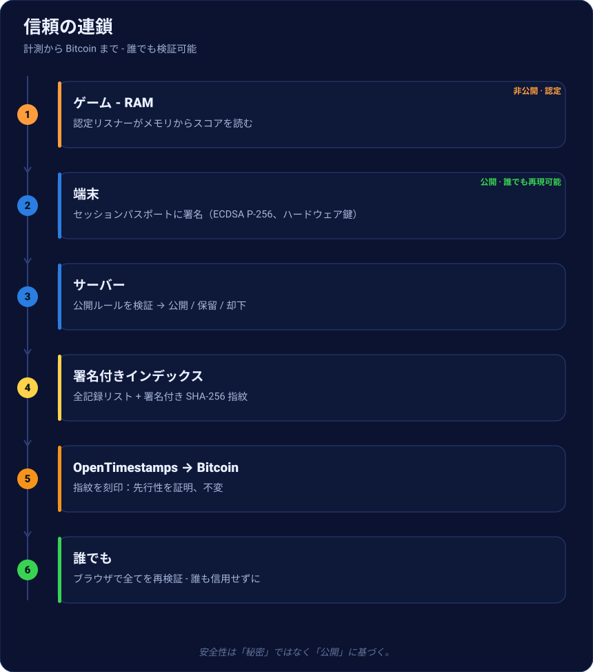

# NelfePlay - 認証レトロスコアリング

**レトロゲームの*本当の*スコアを記録・ランク付けし、誰でも検証可能に - サーバーは ROM も
エミュレータも持ちません。**

[認証された記録 →](records.md){ .md-button .md-button--primary }
[スコアを検証 →](https://nelfeplay.com/verify/){ .md-button }

## 一文で言えば
> **ルールと検証は公開・再現可能**。**メモリ計測**は、**認定・署名・版管理・監査**された
> **専有リスナー**が行う。

## 公開されているもの（本リポジトリ）
**パスポート形式**（`schemas/`）・**検証アルゴリズム**（`ref/`、複数言語の *CoreVerifier*）
・**署名済みプロファイル**（`manifest/`）・再現可能な**テストベクタ**（`vectors/`）・
**却下コード**、**ランキング規則**、**Bitcoin アンカー**の証明。

## 私たちを信用せず検証する
1. **署名** - 各パスポートは正規形（JCS, RFC 8785）に対して署名（ECDSA P-256）。
2. **ベクタ** - `vectors/*` に公開検証ツールを実行：私たちと同じ判定。
3. **先行性** - 各スコアは **OpenTimestamps で Bitcoin** にアンカー。

## さらに詳しく
- [認証された記録 - 全プロセス](records.md)
- [透明性：何が公開で何が非公開か](transparence.md)
- [自分でスコアを検証](verifier-un-score.md)
- [検証ツールをホスト](heberger-le-verifieur.md)
- [リスナーの認定](homologation.md)
