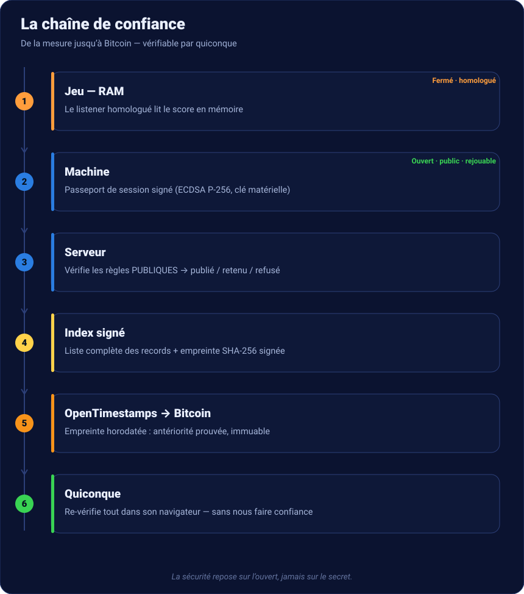

# NelfePlay — Scoring rétro certifié

**Enregistrer et classer le *vrai* score d'un jeu rétro, de façon vérifiable par
n'importe qui — sans que le serveur possède la ROM ni l'émulateur.**

[Les records certifiés →](records.md){ .md-button .md-button--primary }
[Vérifier un score →](https://nelfeplay.com/verify/){ .md-button }

## Le principe en une phrase
> Les **règles et la vérification** sont **publiques et rejouables**. La **mesure
> mémoire** est réalisée par un **listener propriétaire homologué, signé, versionné et
> audité**.

## Ce qui est public (ce dépôt)
Le **format du passeport** (`schemas/`) · l'**algorithme de vérification** (`ref/`, le
*CoreVerifier*, en plusieurs langages) · les **profils signés** (`manifest/`) · les
**vecteurs de test** rejouables (`vectors/`) · les **codes de refus**, les **règles de
classement**, la preuve d'**ancrage Bitcoin**.

## Trois façons de vérifier, sans nous faire confiance
1. **La signature** — chaque passeport est signé (ECDSA P-256) sur sa forme canonique
   (JCS, RFC 8785).
2. **Les vecteurs** — lancez le vérifieur public sur `vectors/*` : mêmes verdicts que nous.
3. **L'antériorité** — chaque score est ancré via **OpenTimestamps sur Bitcoin**.

## Aller plus loin
- [Les records certifiés — tout le process](records.md)
- [Transparence : ce qui est ouvert, ce qui ne l'est pas](transparence.md)
- [Vérifier un score soi-même](verifier-un-score.md)
- [Héberger le vérifieur](heberger-le-verifieur.md)
- [Homologation du listener](homologation.md)
