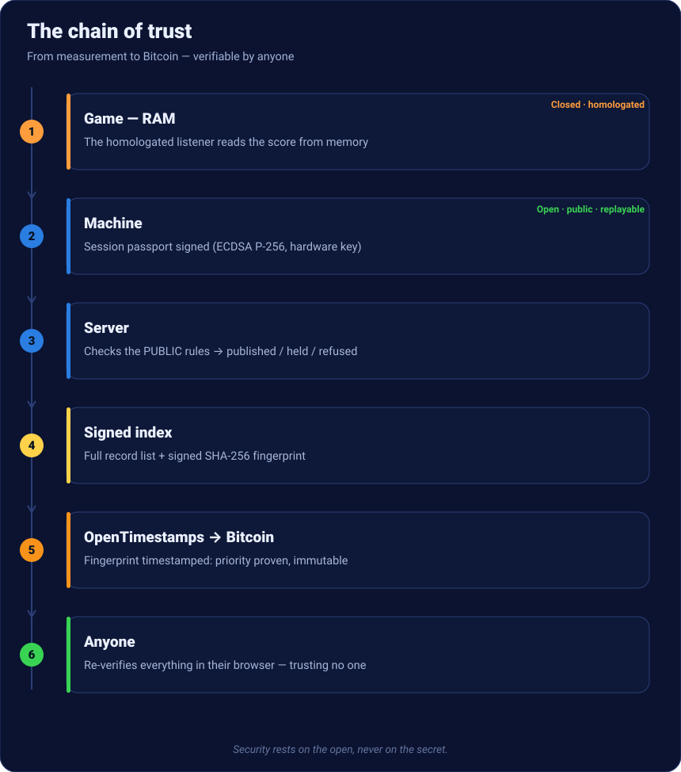

# Certified records

A **public leaderboard** of retro scores that **nobody can fake** — and that **anyone
can verify**, without trusting us. Here is everything that happens, from the game played
to the proof on Bitcoin.

[See the live leaderboard →](https://nelfeplay.com/records/megadrive/sonic-the-hedgehog/1cc/){ .md-button .md-button--primary }
[Verify it yourself →](https://nelfeplay.com/verify/){ .md-button }

## The chain of trust, at a glance

Every step is **either public and replayable, or homologated and signed**. Security
**never** rests on a secret (Kerckhoffs' principle) — only on the open.

## 1 · Measured, not declared
The score is **not sent by the game**. A **homologated component** (the *listener*) reads
the value straight from the emulator's memory, at the source, with timestamped
*checkpoints*. No "declared" score ever enters the system.

## 2 · Signed on the machine
The cabinet assembles a **session passport** (score, core/dump/listener fingerprints,
checkpoints, ticket) and **signs** it with a **non-exportable** hardware key
(ECDSA P-256). One byte changed afterwards = invalid signature.

## 3 · Verified server-side
The server **does not replay the game**: it applies **public rules** (the open-source
*CoreVerifier*) — expected fingerprints, trajectory monotonicity, game end, valid ticket
— then returns a verdict: **published**, **held** (statistical anomaly, never a hard
refusal) or **refused**. No human referee.

## 4 · Published in a signed index
Published scores form a **signed index**: the full list + a **SHA-256 fingerprint**
signed by the issuer. This index rebuilds the leaderboard — and makes a database loss
**inconsequential** (it is rebuildable and mirrorable).

## 5 · Sealed on Bitcoin
The index fingerprint is **timestamped on Bitcoin** via **OpenTimestamps**. Once
confirmed, it proves the records **existed before a given block** — **immutable**
priority. A freshly sealed score shows in **gold**; the `.ots` proof is downloadable and
verifiable with the standard OpenTimestamps client.

## 6 · The record certificate
Each score has an **immutable, shareable** page: score, dump fingerprints
(MD5 + SHA-256), signature ✓, and the **Bitcoin seal** (block). No rank on it — the rank
lives on the leaderboard.

## 7 · Verifiable without trusting us
The **public verifier** recomputes the fingerprint, **verifies the signature** (Web
Crypto) and reads the seal state — **in your browser**. It takes nothing at face value.
You can even **host it yourself**.

[Verify now →](https://nelfeplay.com/verify/){ .md-button .md-button--primary }
[Host the verifier →](heberger-le-verifieur.md){ .md-button }

## The honest limit
The open protocol **does not mathematically prove** the closed listener *read* the right
address. It proves the **homologated build was present, bound to the right process,
unmodified**, and that the **public rules were applied**. Trust in the *measurement*
comes from a listener that is **homologated, signed, versioned, audited** — see
[Transparency](transparence.md) and [Homologation](homologation.md).
