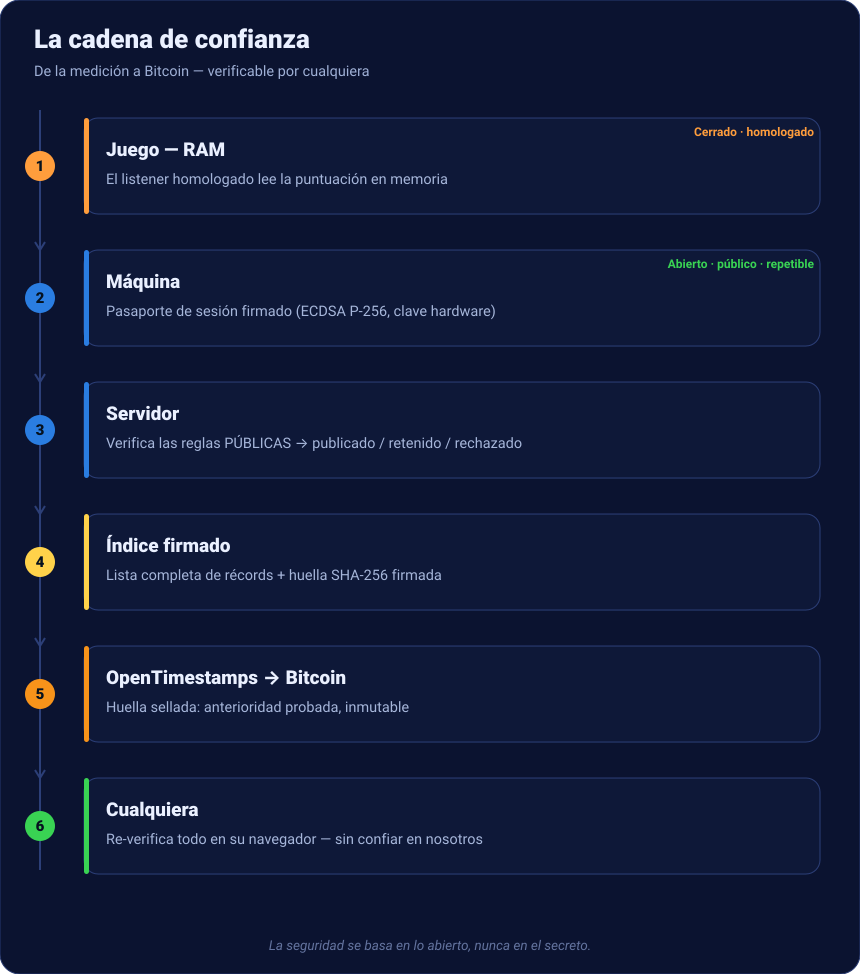

# Récords certificados

Una **clasificación pública** de puntuaciones retro que **nadie puede falsificar** — y
que **cualquiera puede verificar**, sin confiar en nosotros. Esto es todo lo que ocurre,
desde la partida jugada hasta la prueba en Bitcoin.

[Ver la clasificación en vivo →](https://nelfeplay.com/records/megadrive/sonic-the-hedgehog/1cc/){ .md-button .md-button--primary }
[Verificar tú mismo →](https://nelfeplay.com/verify/){ .md-button }

## La cadena de confianza, de un vistazo

Cada paso es **público y repetible, o homologado y firmado**. La seguridad **nunca** se
basa en un secreto (principio de Kerckhoffs) — solo en lo abierto.

## 1 · Medido, no declarado
La puntuación **no la envía el juego**. Un **componente homologado** (el *listener*) lee
el valor directamente en la memoria del emulador, en el origen, con *checkpoints*
sellados. Ninguna puntuación «declarada» entra en el sistema.

## 2 · Firmado en la máquina
La máquina arma un **pasaporte de sesión** (puntuación, huellas de core/dump/listener,
checkpoints, ticket) y lo **firma** con una clave hardware **no exportable**
(ECDSA P-256). Un byte cambiado después = firma inválida.

## 3 · Verificado en el servidor
El servidor **no repite el juego**: aplica **reglas públicas** (el *CoreVerifier*, open
source) — huellas esperadas, monotonía de la trayectoria, fin de partida, ticket válido
— y emite un veredicto: **publicado**, **retenido** (anomalía estadística, nunca un
rechazo seco) o **rechazado**. Sin árbitro humano.

## 4 · Publicado en un índice firmado
Las puntuaciones publicadas forman un **índice firmado**: la lista completa + una
**huella SHA-256** firmada por el emisor. Ese índice reconstruye la clasificación — y
hace que perder la base de datos sea **irrelevante** (es reconstruible y replicable).

## 5 · Sellado en Bitcoin
La huella del índice se **sella en Bitcoin** vía **OpenTimestamps**. Una vez confirmada,
prueba que los récords **existían antes de un bloque dado** — anterioridad **inmutable**.
Una puntuación recién sellada se muestra en **oro**; la prueba `.ots` es descargable y
verificable con el cliente OpenTimestamps estándar.

## 6 · El certificado de récord
Cada puntuación tiene una página **inmutable y compartible**: puntuación, huellas del
dump (MD5 + SHA-256), firma ✓ y el **sello Bitcoin** (bloque). Sin rango — el rango vive
en la clasificación.

## 7 · Verificable sin confiar en nosotros
El **verificador público** recalcula la huella, **verifica la firma** (Web Crypto) y lee
el estado del sello — **en tu navegador**. No da nada por sentado. Incluso puedes
**alojarlo tú mismo**.

[Verificar ahora →](https://nelfeplay.com/verify/){ .md-button .md-button--primary }
[Alojar el verificador →](heberger-le-verifieur.md){ .md-button }

## El límite, dicho con honestidad
El protocolo abierto **no prueba matemáticamente** que el listener cerrado *leyó* la
dirección correcta. Prueba que el **build homologado estaba presente, ligado al proceso
correcto, sin modificar**, y que se aplicaron las **reglas públicas**. La confianza en la
*medición* viene de un listener **homologado, firmado, versionado, auditado** — ver
[Transparencia](transparence.md) y [Homologación](homologation.md).
