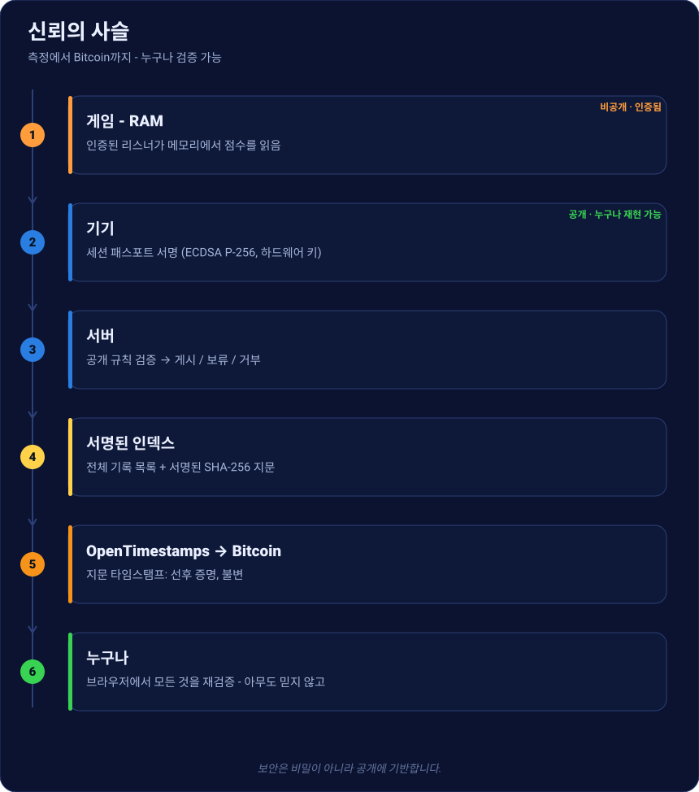
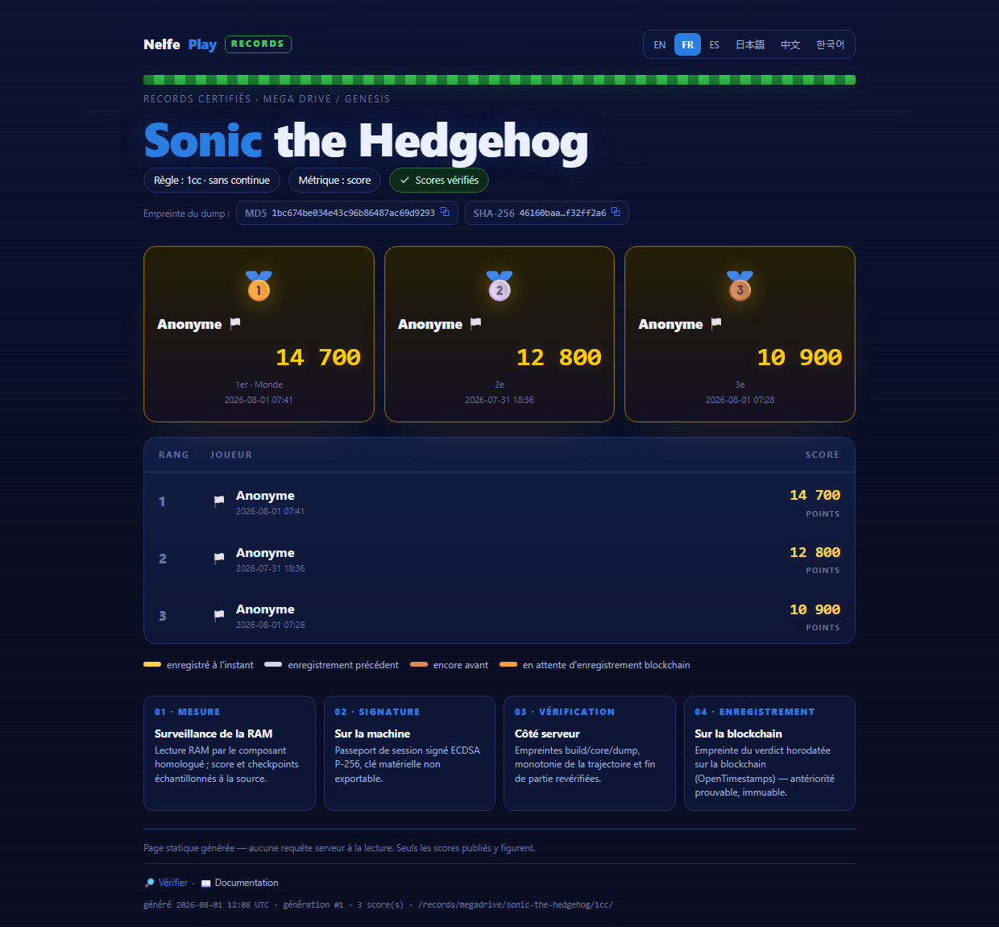
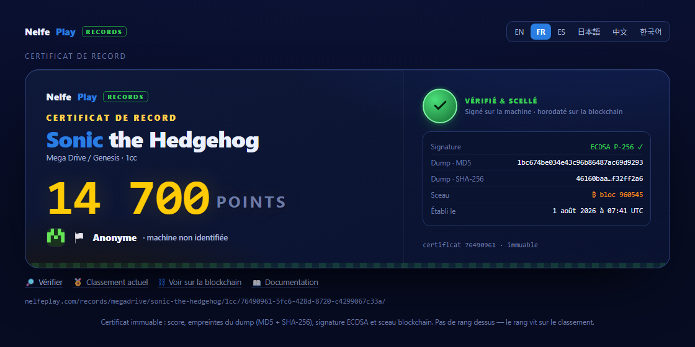
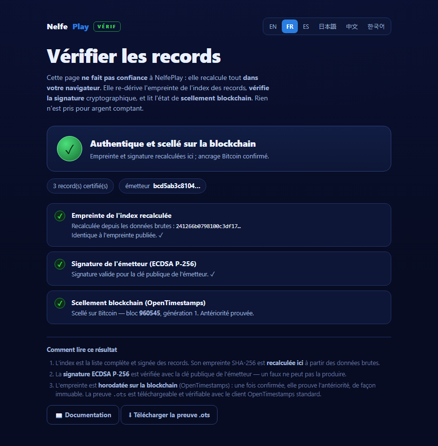

# 인증된 기록

**누구도 조작할 수 없는** 레트로 점수 **공개 순위표** — 그리고 우리를 믿지 않고도 **누구나
검증**할 수 있습니다. 플레이부터 Bitcoin 상의 증명까지, 일어나는 모든 것입니다.

[실시간 순위 보기 →](https://nelfeplay.com/records/megadrive/sonic-the-hedgehog/1cc/){ .md-button .md-button--primary }
[직접 검증하기 →](https://nelfeplay.com/verify/){ .md-button }

## 신뢰의 사슬 한눈에

각 단계는 **공개·재현 가능**하거나 **인증·서명**되어 있습니다. 보안은 비밀이 아니라
**공개**에만 기반합니다(케르크호프스 원리).

## 1 · 신고가 아니라 측정
점수는 **게임이 보내지 않습니다**. **인증 구성요소**(*리스너*)가 에뮬레이터 메모리에서,
원천에서, 타임스탬프가 찍힌 *체크포인트*와 함께 직접 읽습니다. “신고” 점수는 시스템에
들어오지 않습니다.

## 2 · 기기에서 서명
기기는 **세션 패스포트**(점수, 코어/덤프/리스너 지문, 체크포인트, 티켓)를 만들고
**비추출** 하드웨어 키(ECDSA P-256)로 **서명**합니다. 이후 1바이트라도 바뀌면 서명 무효.

## 3 · 서버에서 검증
서버는 **게임을 재실행하지 않습니다**. **공개 규칙**(오픈소스 *CoreVerifier*) — 기대 지문,
궤적 단조성, 게임 종료, 유효 티켓 — 을 적용하고 **게시** / **보류**(통계 이상, 즉시 거부는
없음) / **거부** 판정을 내립니다. 사람 심판은 없습니다.

## 4 · 서명된 인덱스에 게시
게시된 점수는 **서명된 인덱스**를 이룹니다. 전체 목록 + 발행자가 서명한 **SHA-256 지문**.
이 인덱스가 순위를 재구성하며, 데이터베이스 손실을 **무의미**하게 만듭니다(재구성·미러
가능).

## 5 · Bitcoin에 봉인
인덱스 지문을 **OpenTimestamps**로 **Bitcoin에 타임스탬프**합니다. 확인되면 기록이 **특정
블록 이전에 존재**했음을 증명합니다 — **불변**의 선후. 갓 봉인된 점수는 **금색**으로
표시되며, `.ots` 증명은 다운로드하여 표준 OpenTimestamps 클라이언트로 검증할 수 있습니다.

## 6 · 기록 증명서
각 점수에는 **불변·공유 가능**한 페이지가 있습니다. 점수, 덤프 지문(MD5 + SHA-256),
서명 ✓, 그리고 **Bitcoin 봉인**(블록). 순위는 없습니다 — 순위는 순위표에 있습니다.

## 7 · 우리를 믿지 않고 검증 가능
**공개 검증기**는 지문을 재계산하고 **서명을 검증**(Web Crypto)하며 봉인 상태를 읽습니다 —
**당신의 브라우저에서**. 아무것도 곧이곧대로 받아들이지 않습니다. **직접 호스팅**할 수도
있습니다.

[지금 검증 →](https://nelfeplay.com/verify/){ .md-button .md-button--primary }
[검증기 호스팅 →](heberger-le-verifieur.md){ .md-button }

## 정직한 한계
오픈 프로토콜은 닫힌 리스너가 올바른 주소를 *읽었다*는 것을 **수학적으로 증명하지
않습니다**. 증명하는 것은 **인증 빌드가 존재했고, 올바른 프로세스에 묶였으며, 수정되지
않았고**, **공개 규칙이 적용**되었다는 것입니다. *측정*에 대한 신뢰는 **인증·서명·버전
관리·감사**된 리스너에서 옵니다 — [투명성](transparence.md), [인증](homologation.md) 참조.
