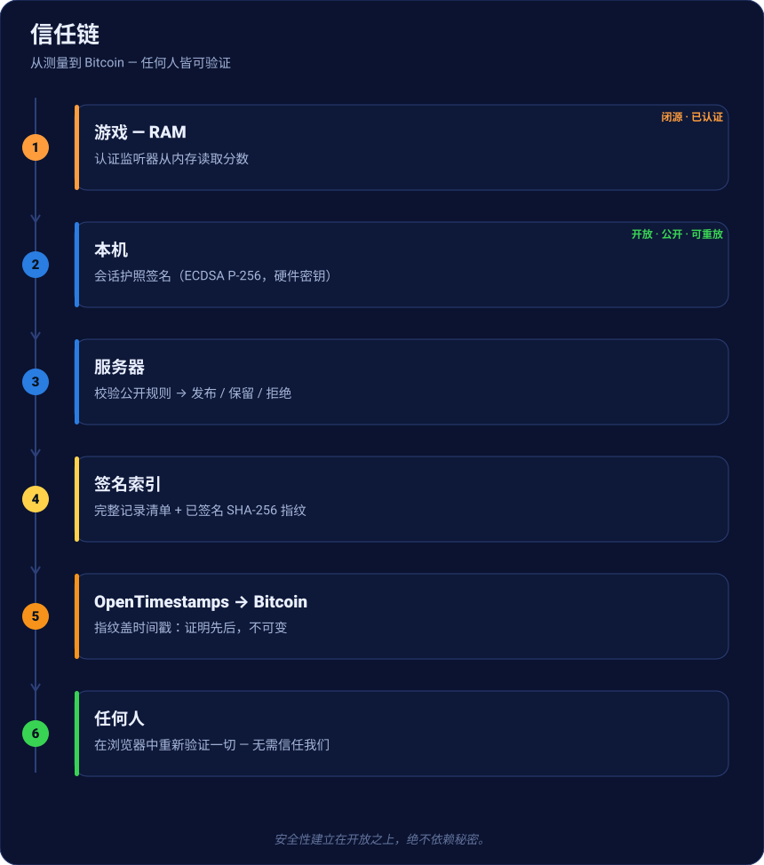

# 认证记录

一个**无人能造假**的复古分数**公开排行榜** —— 而且**任何人都能验证**，无需信任我们。以下
是从游玩到 Bitcoin 上证明的全过程。

[查看实时排行榜 →](https://nelfeplay.com/records/megadrive/sonic-the-hedgehog/1cc/){ .md-button .md-button--primary }
[亲自验证 →](https://nelfeplay.com/verify/){ .md-button }

## 信任链一览

每一步要么**公开且可重放**，要么**已认证并签名**。安全性**从不**依赖秘密（柯克霍夫斯原
则），只依赖开放。

## 1 · 测量，而非申报
分数**不由游戏发送**。一个**认证组件**（*监听器*）直接从模拟器内存中、在源头、带时间戳的
*检查点*读取。任何“申报”分数都不会进入系统。

## 2 · 在本机签名
本机组装**会话护照**（分数，核心/转储/监听器指纹，检查点，票据），并用**不可导出**的硬件
密钥（ECDSA P-256）**签名**。事后改动一个字节 = 签名无效。

## 3 · 服务器端校验
服务器**不重放游戏**：它应用**公开规则**（开源的 *CoreVerifier*）——预期指纹、轨迹单调
性、游戏结束、有效票据——然后给出裁决：**发布**、**保留**（统计异常，绝不硬性拒绝）或
**拒绝**。没有人工裁判。

## 4 · 发布进签名索引
已发布分数构成**签名索引**：完整清单 + 由签发者签名的 **SHA-256 指纹**。该索引重建排行
榜，并使数据库丢失**无关紧要**（可重建、可镜像）。

## 5 · 封印于 Bitcoin
索引指纹通过 **OpenTimestamps** **盖时间戳于 Bitcoin**。一经确认，即证明记录**存在于某个
区块之前** —— **不可变**的先后。刚封印的分数显示为**金色**；`.ots` 证明可下载，并用标准
OpenTimestamps 客户端验证。

## 6 · 记录证书
每个分数都有**不可变、可分享**的页面：分数、转储指纹（MD5 + SHA-256）、签名 ✓，以及
**Bitcoin 封印**（区块）。上面没有排名 —— 排名在排行榜上。

## 7 · 无需信任我们即可验证
**公开验证器**重算指纹、**验证签名**（Web Crypto）并读取封印状态 —— **在你的浏览器中**。
它绝不轻信。你甚至可以**自行托管**。

[立即验证 →](https://nelfeplay.com/verify/){ .md-button .md-button--primary }
[自行托管验证器 →](heberger-le-verifieur.md){ .md-button }

## 诚实的边界
开放协议**不能在数学上证明**闭源监听器*读取了*正确地址。它证明的是**认证构建存在、绑定到
正确进程、未被修改**，以及**应用了公开规则**。对*测量*的信任来自一个**已认证、已签名、有
版本、经审计**的监听器 —— 见[透明度](transparence.md)与[认证](homologation.md)。
